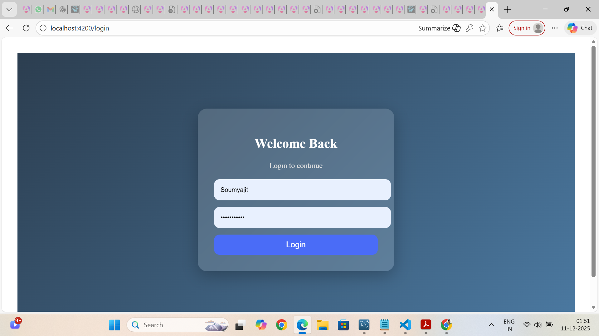
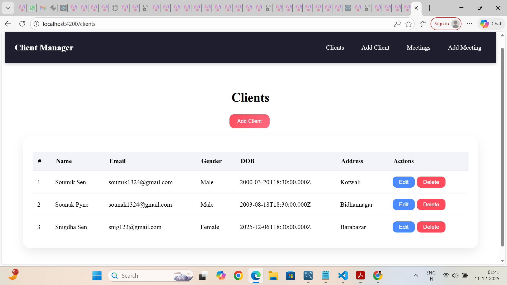
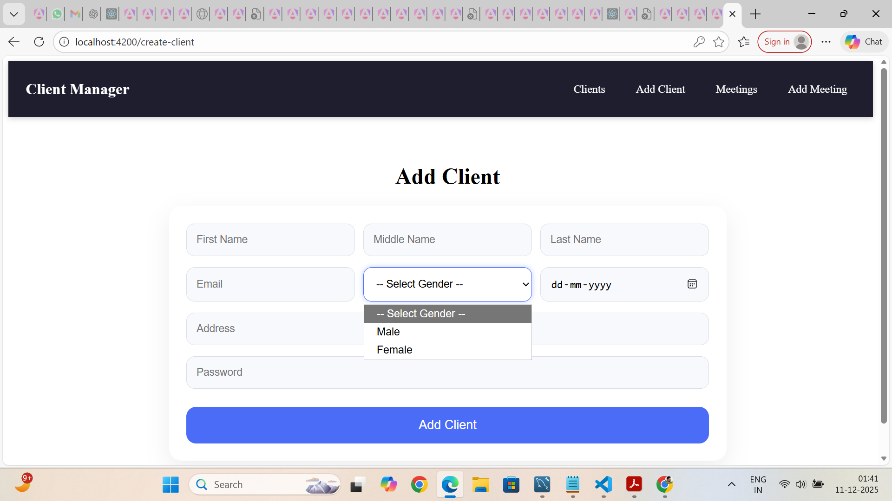
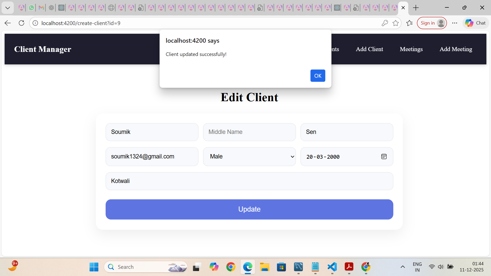
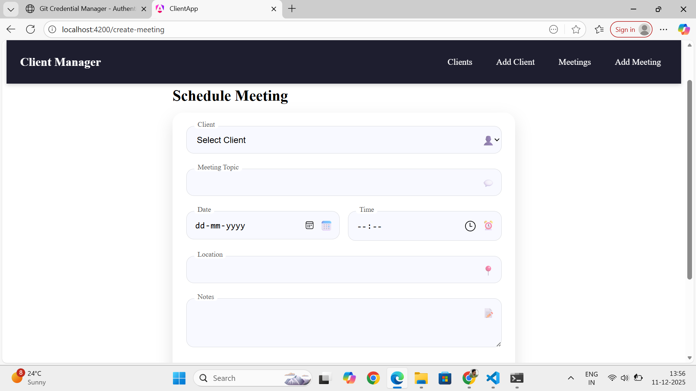
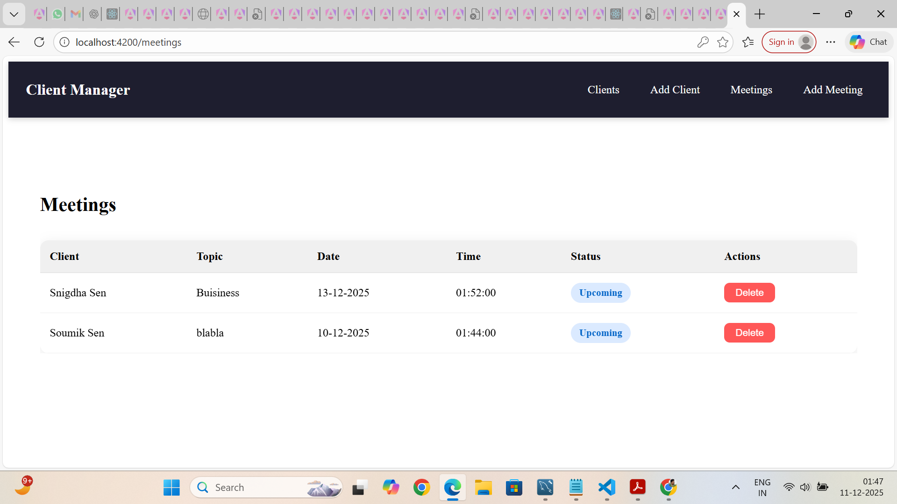

Client & Meeting Management System

A full-stack web application built using Angular, Node.js (Express), and MySQL to manage clients and schedule meetings efficiently.
The system includes authentication, CRUD operations, routing with guards, and a clean, responsive UI.

🚀 Tech Stack
Frontend
Angular
TypeScript
HTML / CSS
Bootstrap
Backend
Node.js (Express.js)
MySQL Database
REST API Architecture

📌 Features
✅ Client Management
Add new clients
Edit client details
Delete client
View list of registered clients

✅ Meeting Scheduling
Create meeting schedules
Update and cancel meetings
Link meetings with specific clients

✅ Authentication
Login system
Route Guards for protected pages

✅ User Interface
Responsive UI
Form validations
Clean navigation flow

📁 Project Structure
Client-Management/
│
├── backend/
│   ├── server.js
│   ├── package.json
│   └── (API routes, DB connection, etc.)
│
└── frontend/
    └── client-app/
        ├── src/app/
        │   ├── components/
        │   │   ├── client-create/
        │   │   ├── client-list/
        │   │   ├── login/
        │   │   └── meeting-create/
        └── angular.json

🗄️ Database Information
MySQL is used as the relational database
A database named client_management is required
Tables include:

clients
meetings
users (for login)
Update your SQL credentials in:
backend/server.js

▶️ How to Run the Project
1. Clone the Repository
git clone https://github.com/Sou000000111/Client-Management.git

2. Install Backend Dependencies
cd backend
npm install

Start backend server:
node server.js

3. Install Frontend Dependencies
cd ../frontend/client-app
npm install

Run Angular app:

ng serve --open

🌐 Default Running Ports
Service	Port
Angular Frontend	http://localhost:4200

Node.js Backend	http://localhost:3000

---

## 📸 Screenshots

### Login Page

### Client List Page

### Add Client Page

### Edit Client Page

### Meeting Scheduler

### Meeting List

---

## 🤝 Contributing

Contributions are always welcome!

To contribute:

1. Fork the repository  
2. Create a new feature branch  
3. Make your changes  
4. Commit and push  
5. Open a Pull Request  

Please ensure your code follows clean coding practices and proper structure.

---

## 📄 License

This project is licensed under the **MIT License**.  
You are free to use, modify, and distribute this project with attribution.

See the **LICENSE** file for more details.

---
